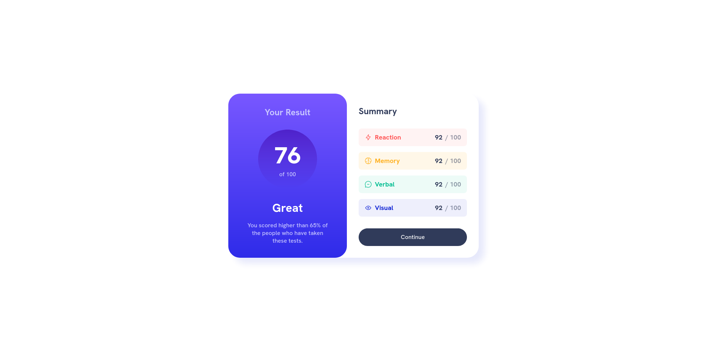
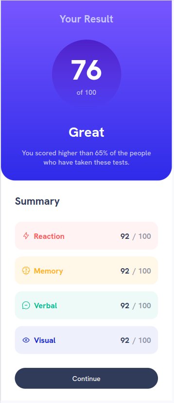

# Frontend Mentor - Results summary component solution

This is a solution to the [Results summary component challenge on Frontend Mentor](https://www.frontendmentor.io/challenges/results-summary-component-CE_K6s0maV). Frontend Mentor challenges help you improve your coding skills by building realistic projects.

## Table of contents

- [Overview](#overview)
  - [The challenge](#the-challenge)
  - [Screenshot](#screenshot)
  - [Links](#links)
- [My process](#my-process)
  - [Built with](#built-with)
  - [What I learned](#what-i-learned)
  - [Continued development](#continued-development)
  - [Useful resources](#useful-resources)
- [Author](#author)

**Note: Delete this note and update the table of contents based on what sections you keep.**

## Overview

### The challenge

Users should be able to:

- View the optimal layout for the interface depending on their device's screen size
- See hover and focus states for all interactive elements on the page
- **Bonus**: Use the local JSON data to dynamically populate the content

### Screenshot





### Links

- Solution URL: [Solution URL](https://github.com/kumarmash/results-summary-component-main)
- Live Site URL: [Live Site URL](https://kumarmash.github.io/results-summary-component-main/)

## My process

### Built with

- Semantic HTML5 markup
- CSS custom properties
- Flexbox
- CSS Grid
- Desktop-first workflow

### What I learned

Learnt how to create gradient and CSS custom properties

To see how you can add code snippets, see below:

```css custom properties
:root {
  /* Primary colors */

  --pc-light-red: hsl(0, 100%, 67%);
  --pc-orangey-yellow: hsl(39, 100%, 56%);
  --pc-green-teal: hsl(166, 100%, 37%);
  --pc-cobalt-blue: hsl(234, 85%, 45%);

  /* Neutral Colors */
  --nc-white: hsl(0, 0%, 100%);
  --nc-pale-blue: hsl(221, 100%, 96%);
  --nc-light-lavender: hsl(241, 100%, 89%);
  --nc-dark-gray-blue: hsl(224, 30%, 27%);

  /* Gradients Colors */

  --bg-light-slate-blue: hsl(252, 100%, 67%);
  --bg-light-royal-blue: hsl(241, 81%, 54%);

  --gc-violet-blue: hsla(256, 72%, 46%, 1);
  --gc-persian-blue: hsla(241, 72%, 46%, 0);

  /* Typography */

  --fs-paragraphs: 18px;

  --font-family: "Hanken Grotesk", sans-serif;

  --fw-medium: 500;
  --fw-bold: 700;
  --fw-extra-bold: 800;
}
```

```css Gradient
selector {
  background-image: linear-gradient(
    var(--bg-light-slate-blue),
    var(--bg-light-royal-blue)
  );
}
```

### Continued development

Keep learning CSS Grid and Flexbox and more about pre-defined classes/psuedo-classes.

### Useful resources

- [CSS gradient](https://www.w3schools.com/css/css3_gradients.asp) - Helped in learning gradient in simplest way.

## Author

- Frontend Mentor - [@kumarmash](https://www.frontendmentor.io/profile/kumarmash)
